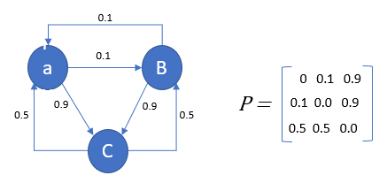
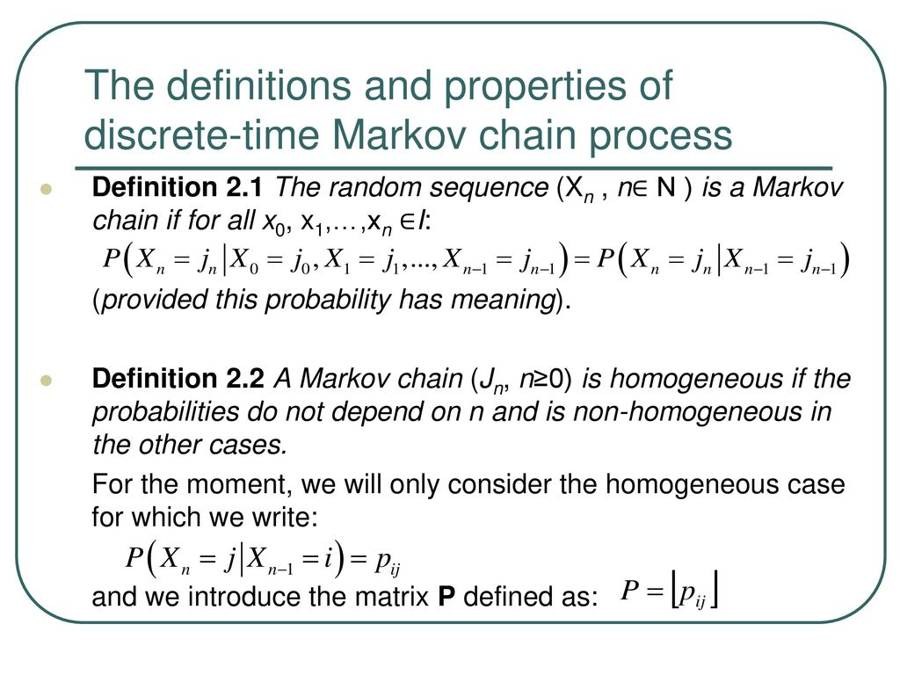

	
```{r setup, include=FALSE}
knitr::opts_chunk$set(echo = TRUE)
```


## Background

This lecture is meant to supplement Chapter 9 in your textbook.

We already performed an analysis on the value of baseball events from seasonal data.

Now we look at simulation as a means for understanding different characteristics of a half-inning.


## Simulating a half inning

We will focus on simulating the events in a half inning using a special probability model called a Markov chain.

By simulating many half-innings using this model, one gets a basic understanding of the pattern of run scoring.


## Markov Chain basics

A Markov chain is a special model describing movement between states.

In a (discrete) Markov chain, a matrix of transition probabilities is used to describe how one moves between the different states.

In a Markov chain, one assumes that the probability of moving to a new state only depends on the current state.

One learns how to move to a new state from the current state by examining the rows of the transition probability matrix.

In a Markov chain, there are two states: transition states and absorbing states. Once one lands in an absorbing state, one cannot return to a transition state.


##



([image credit](https://towardsdatascience.com/markov-chain-analysis-and-simulation-using-python-4507cee0b06e))


## 



([image credit](https://slideplayer.com/slide/13511342/))


## Connecting Markov chains to baseball context

A state is a base out configuration. There are 24 possible base out configurations. 

We will add the 3 out state as an absorbing state, so there are 25 total states.

Example of transition state: 

  - Suppose that there are runners on 1st and 2nd with 1 out.
  - Based on the outcome of the plate appearance, the state can change.
  - For example, the batter can hit a single, the runner on 2nd scores and the runner on 1st moves to 3rd.
  - The new state is now runners on 1st and 3rd with 1 out.

Any baseball events that happened before the current state do not affect the transition probabilities.


## Markov chain for the 2016 season

We need to know the frequencies of transitions from the different base outs states to other such states in order to construct the transition probability matrix.

We will do this for the 2016 season. Attention is restricted to batting plays and complete innings. Non-batting plays such as stolen bases, caught stealing, wild pitches, or passed balls are ignored.

\vspace{12pt}

\tiny
```{r, message=FALSE, warning=FALSE}
library(tidyverse)
```
```{r, message=FALSE, warning=FALSE, cache = TRUE}
fields = read_csv("../../fields.csv")
dat2016 = read_csv("../../all2016.csv", 
                    col_names = pull(fields, Header),
                    na = character())
```


## 

We create \texttt{HALF.INNING} as a unique identification for each half-inning in each baseball game. 

The new variable \texttt{RUNS.SCORED} gives the number of runs scored on each play.

\vspace{12pt}

\tiny
```{r}
dat2016 = dat2016 %>% 
  mutate(RUNS  = AWAY_SCORE_CT + HOME_SCORE_CT, 
         HALF.INNING = paste(GAME_ID, INN_CT, BAT_HOME_ID),
         RUNS.SCORED = (BAT_DEST_ID > 3) + (RUN1_DEST_ID > 3) + 
           (RUN2_DEST_ID > 3) + (RUN3_DEST_ID > 3))

half_innings = dat2016 %>% 
  group_by(HALF.INNING) %>% 
  summarize(Outs.Inning = sum(EVENT_OUTS_CT), 
            Runs.Inning = sum(RUNS.SCORED), 
            Runs.Start = first(RUNS),
            MAX.RUNS = Runs.Inning + Runs.Start)
```


## 

We create the variable \texttt{STATE} which gives the runner locations and outs at the beginning of each play.

The variable \texttt{NEW.STATE} encodes the base out state at the end of the play.

\vspace{12pt}

\tiny
```{r}
dat2016 = dat2016 %>% 
  inner_join(half_innings, by = "HALF.INNING") %>% 
  mutate(BASES = paste(ifelse(BASE1_RUN_ID > '', 1, 0),
                       ifelse(BASE2_RUN_ID > '', 1, 0),
                       ifelse(BASE3_RUN_ID > '', 1, 0), sep = ""), 
         STATE = paste(BASES, OUTS_CT), 
         NRUNNER1 = as.numeric(RUN1_DEST_ID == 1 | BAT_DEST_ID == 1), 
         NRUNNER2 = as.numeric(RUN1_DEST_ID == 2 | RUN2_DEST_ID == 2 | BAT_DEST_ID == 2), 
         NRUNNER3 = as.numeric(RUN1_DEST_ID == 3 | RUN2_DEST_ID == 3 | 
                               RUN3_DEST_ID == 3 | BAT_DEST_ID == 3), 
         NOUTS = OUTS_CT + EVENT_OUTS_CT, 
         NEW.BASES = paste(NRUNNER1, NRUNNER2, NRUNNER3, sep = ""),
         NEW.STATE = paste(NEW.BASES, NOUTS))

## restrict attention to state changes and complete innings; remove non-batting plays.
## remove base out context when absorbing state is reached, 
## and change the name of this state.
dat2016 = dat2016 %>% filter((STATE != NEW.STATE) | (RUNS.SCORED > 0))
dat2016C = dat2016 %>% filter(Outs.Inning == 3, BAT_EVENT_FL == TRUE)
dat2016C = dat2016C %>% mutate(NEW.STATE = gsub("[0-1]{3} 3", "3", NEW.STATE))
```


## Computing the transition probabilities 

With the \texttt{STATE} and \texttt{NEW.STATE} variables defined, we can compute the frequencies of all possible transitions.

\vspace{12pt}

\tiny
```{r}
T_matrix = dat2016C %>% 
  select(STATE, NEW.STATE) %>% 
  table()

P_matrix = prop.table(T_matrix, 1)

## add a row to give meaning to the absorbing state
P_matrix = rbind(P_matrix, c(rep(0, 24), 1))
```


## 

Example of the transition matrix using the "000 0" state. 

The \texttt{as.tibble} and \texttt{gather} functions are used to display the probabilities vertically.

\vspace{12pt}

\tiny
```{r, warning=FALSE}
P_matrix %>% 
  as.tibble(rownames ="STATE") %>% 
  filter(STATE == "000 0") %>% 
  gather(key = "NEW.STATE", value = "Prob", -STATE) %>% 
  filter(Prob > 0)
```


## Simulating the Markov chain

We will use Markov chains to obtain the distribution of runs scored in a half-inning.

The first step is to construct a matrix giving the runs scored in all possible transitions between states.

Let $N_{\text{runners}}$ denote the number of runners in a state, and $O$ denote the number of outs. For a batting play ($s \to t$), the number of runs scored is equal to,
$$
  R = (N_{\text{runners}}^{(s)} + O^{(s)} + 1) - (N_{\text{runners}}^{(t)} + O^{(t)}).
$$

We define a function which takes a state as input and returns the number of runs and outs. 

\vspace{12pt}

\tiny
```{r}
count_runners_out = function(s){
  s %>% str_split("") %>% pluck(1) %>% as.numeric() %>% sum(na.rm = TRUE)
}
  
runners_out = sapply(row.names(T_matrix), 
                      count_runners_out)[-25]
```


## 

The \texttt{outer} functions with the "-" operation performs the runs $R$ calculation for all possible pairs of states.

\vspace{12pt}

\tiny
```{r}
R = outer(runners_out + 1, runners_out, FUN = "-")
names(R) = names(T_matrix)[-25]
R = cbind(R, rep(0,24))
```


## 

We are now ready to simulate a half-inning of baseball using a new function. 

The inputs of this function are:

  - probability transition matrix \texttt{P}
  - the runs matrix \texttt{R}
  - the starting state \texttt{s}
  
The output is the the number of runs scored in the half-inning  

\vspace{12pt}

\tiny
```{r}
set.seed(430)
simulate_half_inning = function(P, R, start = 1){
  s = start
  path = NULL
  runs = 0
  while(s < 25){
    s.new = sample(1:25, size = 1, prob = P[s, ])
    path = c(path, s.new)
    runs = runs + R[s, s.new]
    s = s.new
  }
  runs
}
```


## Let's try it out

\tiny
```{r, cache=TRUE}
B = 1e5
system.time({
  RUNS = replicate(B, simulate_half_inning(P_matrix, R))
})
```

\normalsize
Some inferences:

\vspace{12pt}

\tiny
```{r}
## table of runs
table(RUNS)

## chance of scoring 5 or more runs
sum(RUNS >= 5) / B

## average number of runs
mean(RUNS)
```


## Compare with Runs Expectancy

\tiny
```{r}
RUNS.j = function(j){
  mean(replicate(B, simulate_half_inning(P_matrix, R, j)))
}
```

\tiny
```{r, warning=FALSE,message=FALSE,cache=TRUE}
library(doMC)
library(parallel)
registerDoMC(cores=detectCores()-2)
## important for reproducibility
RNGkind(kind = "L'Ecuyer-CMRG")
system.time({
  RE_bat = foreach(j = 1:24) %dopar% RUNS.j(j) %>% 
    unlist() %>%
    matrix(nrow = 8, ncol = 3, byrow = TRUE, 
           dimnames =list(c("000","001","010","011",
                          "100","101","110","111"),
                          c("0 outs", "1 out", "2 outs")))
})
```


\tiny
```{r}
round(RE_bat, 2)
```


##

We see that the Markov chain simulation does well, but it misses on the run scoring value of non-batting plays.

\vspace{12pt}

\tiny
```{r}
RE = matrix(c(0.47, 0.25, 0.10, 1.45, 0.94, 0.32, 1.06, 0.65,
               0.31, 1.93, 1.34, 0.54, 0.84, 0.50, 0.22, 1.75,
               1.15, 0.49, 1.41, 0.87, 0.42, 2.17, 1.47, 0.76),
               8, 3, byrow=TRUE)
round(RE - RE_bat, 2)
```


## Beyond run expectancy

We can learn about the movement through the base out states. For example, let's investigate the typical states after 3 PAs to start a half-inning

\vspace{12pt}

\tiny
```{r}
P_matrix_3 = P_matrix %*% P_matrix %*% P_matrix

P_matrix_3 %>% as_tibble(rownames = "STATE") %>% 
  filter(STATE == "000 0") %>% 
  gather(key = "NEW.STATE", value = "Prob", -STATE) %>% 
  arrange(desc(Prob)) %>% 
  head()
```


## Transition probabilities for individual teams

We construct a data frame \texttt{Team.T} giving the transitions for each team.

\vspace{12pt}

\tiny
```{r}
dat2016C = dat2016C %>% 
  mutate(HOME_TEAM_ID = str_sub(GAME_ID, 1, 3), 
         BATTING.TEAM = ifelse(BAT_HOME_ID == 0,
                               AWAY_TEAM_ID, HOME_TEAM_ID))

Team.T = dat2016C %>% 
  group_by(BATTING.TEAM, STATE, NEW.STATE) %>% 
  count()

Team.T %>% filter(BATTING.TEAM == "SLN")
```


## 

Adjustments for rare transitions need to be made to get reliable predictions.

Let $p^{\text{TEAM}}$ denote a team's transition probability, and let $p^{\text{ALL}}$ be the marginal transition probabilities across all teams. Then, a reliable estimate is given by
$$
  p^{\text{EST}} = \frac{n}{n + K}p^{\text{TEAM}} + \frac{K}{n + K}p^{\text{ALL}}
$$
where $n$ is the number of transitions and $K$ is a smoothing count. Here, we will let $K = 1274$ (reasons beyond scope of course).


## 

Let's demonstrate the smoothing with respect to the Cardinals 2016 seasonal results in the "100 2" base out state.

\vspace{12pt}

\tiny
```{r, message=FALSE}
Team.T.S = dat2016C %>% filter(STATE == "100 2") %>% 
  group_by(BATTING.TEAM, STATE, NEW.STATE) %>% tally()

SLN.Trans = Team.T.S %>% filter(BATTING.TEAM == "SLN") %>% 
  mutate(p = n / sum(n))

All.Trans = dat2016C %>% filter(STATE == "100 2") %>% 
  group_by(NEW.STATE) %>% tally() %>% 
  mutate(p = n / sum(n))

SLN.Trans %>% inner_join(All.Trans, by = "NEW.STATE") %>% 
  mutate(p.EST = n.x / (1274 + n.x) * p.x + 1274 / (1274 + n.x) * p.y) %>% 
  ## needs to be normalized
  mutate(p.EST = p.EST / sum(p.EST)) %>%
  select(BATTING.TEAM, NEW.STATE, p.x, p.y, p.EST)
```


